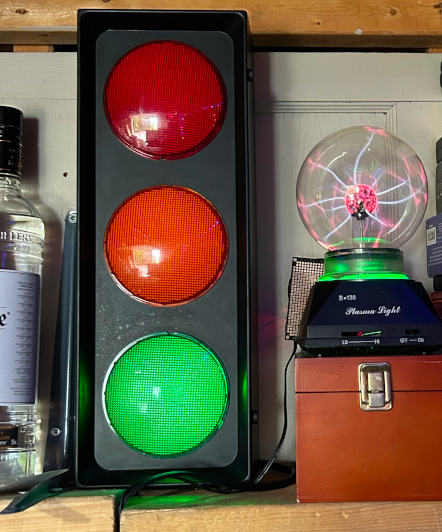

# redlightgreenlight: Retrofit to cheap stoplight-themed room light

This drives LEDs to make a stoplight-themed room light behave more like a real stoplight. In my typical style, it was done with absolutely no regard to accuracy or safety and with every intent to get it out of my house as fast as possible.

## Project details

Standard stoplight-themed room light found at Value Village. Bought it with the hopes it would behave like a normal stoplight. Was sadly disappointed that all three lights stayed lit. Then kept it around for a couple of months until it was time to hack it and get it out the door.

## What you need

* Trafic Lite Model 49007 or similar
* ATTinyX5 series (could also be ported to ATTiny402 etc.)
* NPN transistors
* Current limiting resistors
* LEDs that output a decent amount of lumens

## Schematic

Very simple LED flasher. We reuse the existing AC cable to hack on a USB power supply, then route the output of the USB power supply to the ATTiny and our lights. Outputs of the ATTiny drive the transistors and our lights blink as appropriate. Pattern starts with the classic advanced-left flasher then cycles green-yellow-red.

## Bugs

Won't fix them. Anyone could write code like this.

## License

Public domain
